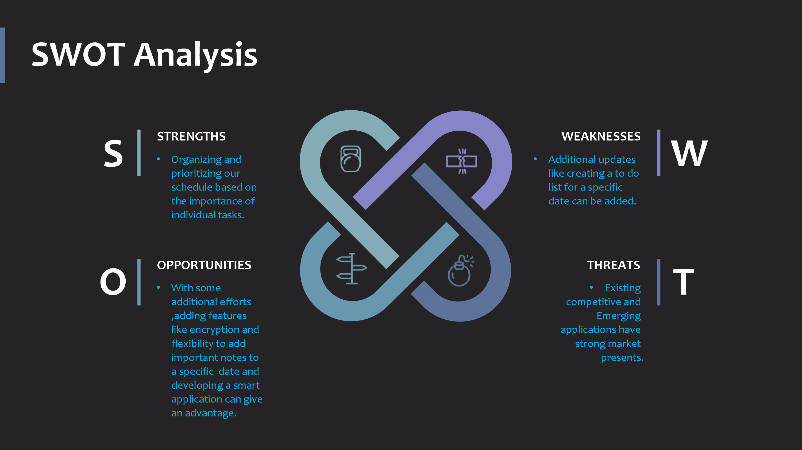

# CALENDAR PROJECT
## Introduction:
A calendar is a system of organizing days. This is finished by offering names to timeframes, normally days, weeks, months and years. A date is the assignment of a solitary, explicit day inside such a framework. A schedule is additionally an actual record (regularly paper) of such a framework. A schedule can likewise mean a rundown of arranged occasions, for example, a court schedule or an incompletely or completely ordered rundown of archives, like a schedule of wills. 

Periods in a schedule (like years and months) are as a rule, however not really, synchronized with the pattern of the sun or the moon. The most widely recognized sort of pre-present day schedule was the lunisolar schedule, a lunar schedule that once in a while adds one intercalary month to stay synchronized with the sun based year over the long haul.     

 
## Objective: 
1. My project is a multi-functional calendar application that enables users to Make their Daily routine workflow easier with 4 Basic Modules. It gives the complete details of the calendar in which it declares the year information(  no. of weeks, no. of days, whether it is a leap year or not, no of months, starting weekday of the year ), Day information, month information, yearly calendar display, month calendar display.This project aims to simplify to maintain the data of a complete calendar of any year.
# Research
Research Calendar, intends to help you navigate the many programing opportunities and resources available to support your research endeavors at Princeton, including junior and senior independent work. Use this one-stop resource to learn about upcoming events and plan ahead for important deadlines regarding funding, internships, and fellowships.
## Benefits
1. It keeps us accountable.
2. It keeps us realistic.
3. It keeps us on track.
4. It sets boundaries.
* Calendars are a simple and effective tool to help keep us productive and maximize our day

## 4W's and 1H
### Who: 
Calendar is an application which is used to know the Date,Day and an year .It is used by any human being in any time knowing/tracking purpose.

### What:
It is helpful in order to check the data of any date,day,month and year.And can add the note to a particular date in an year.

### When:
It can be to set the timeline of our personal and professional tasks.

### Where:
It is used in organizing the timeline of any task.For example about projects,constructions,hospitals,etc..

### How:
This project is implemented to get the data of a particular day by giving year as an input.

## Swot Analysis:

